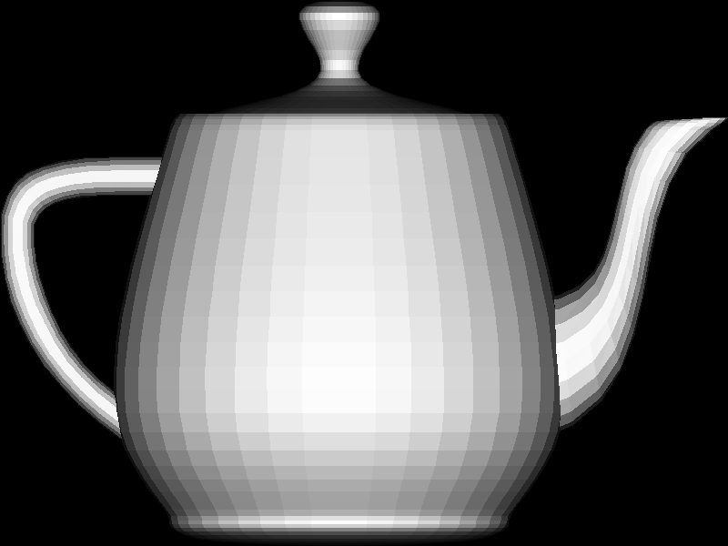

# renderer

An experiment in software rendering to teach me more about it. Based on
ssloy/tinyrenderer but adapted and written in C99.



## todo

- [x] Remove SDL2 and go back to using raw PPM images
- [x] Fix inverted Y axis from OBJ file parsing
- [ ] Implement full OBJ file parsing rather than just a subset
- [ ] Texturing
- [ ] Perspective projection

## requirements

Tested to work on MacOS and Linux.

## build and run

```shell
$ mkdir build
$ make
$ ./build/renderer
```
